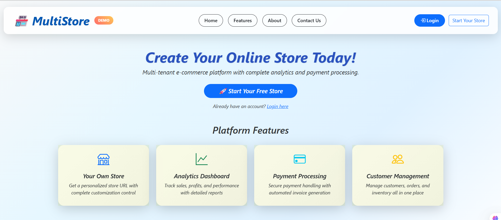
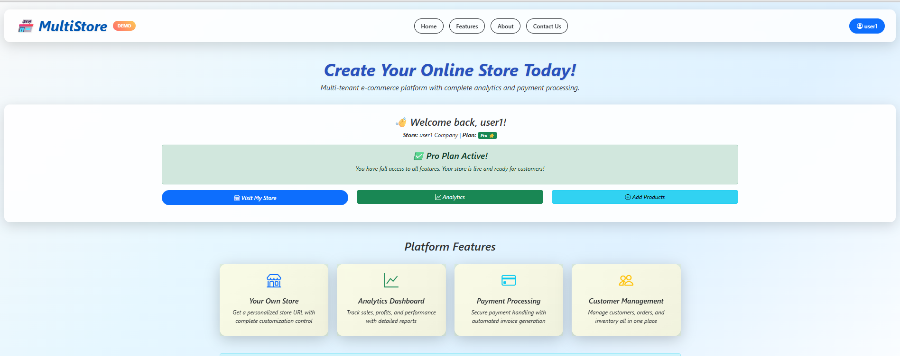
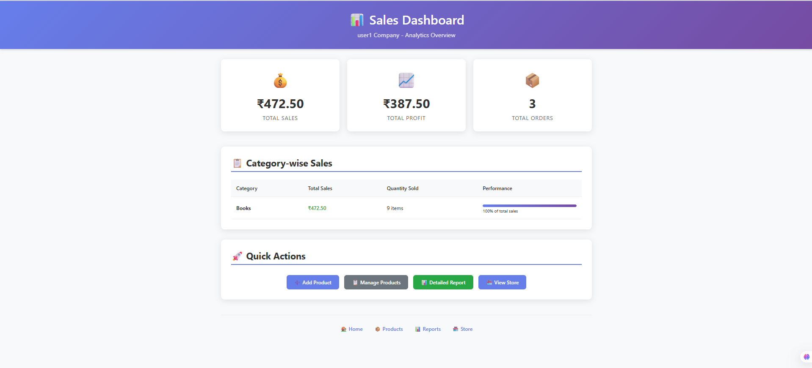
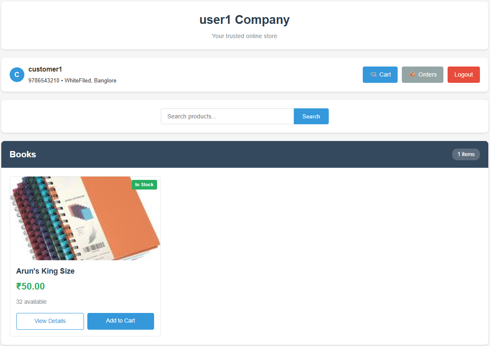
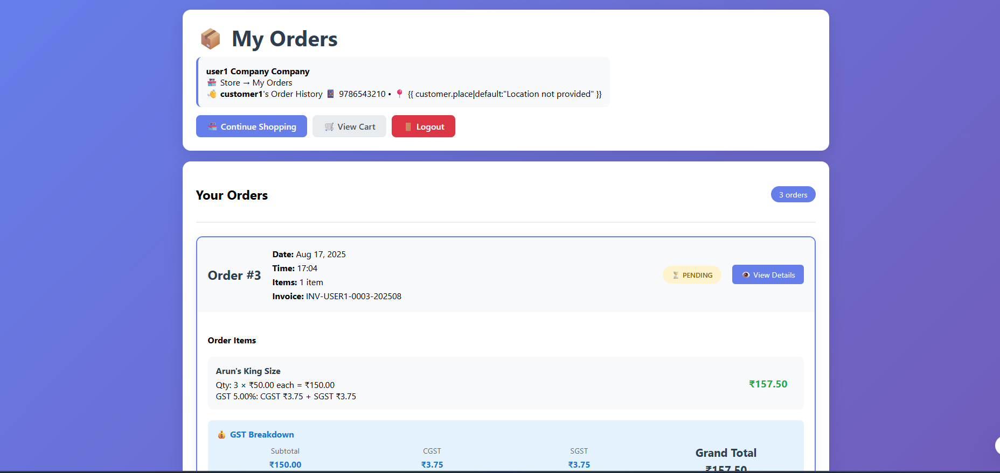

# 🧾 InvoxiaGST – GST Billing & Invoice Management System  

A full-stack **E-Commerce & GST Billing Platform** that helps small and medium businesses manage:  
✅ Customer & product records  
✅ GST-compliant invoice generation  
✅ Sales history & analytics dashboards  
✅ PDF invoice export  

This project was developed as part of a **Semester-2 project** to combine **Django concepts, frontend development, and analytics**.  

---

## 🚀 Features  

### 🔐 Authentication & User Management  
- Secure login and signup  
- Each registered user maintains their own store  
- Separate database per registered user  

### 📦 Customer & Product Management  
- Add, update, or delete products  
- Product fields:  
  - Name  
  - GST Rate  
  - Selling Price  
  - Stock availability  

### 🧾 Invoice Management  
- Auto GST calculation (SGST + CGST)  
- Create invoices with multiple products  
- Download invoices as **PDF**  

### 📜 Invoice History & Filters  
- Track sales by **customer** or **date**  
- View history of sold items and stock left  
- Track payment status  

### 📊 Data Analytics Dashboard  
- Monthly & yearly GST collection reports  
- Product-wise sales summaries  
- Top customer insights  

### 📤 Export  
- Export invoices as PDF  

---

## 🛠️ Technology Stack  

**Backend**  
- Python 3.11  
- Django 
- Jinja2 templates  

**Database**
- PostgreSQL

**Frontend**  
- HTML, CSS, Bootstrap , JavaScript 
 

---

## ⚡ Installation & Setup  

1. **Clone the Repository**  
```bash
git clone https://github.com/Tejas132005/E-Commerce-Platform.git
cd E-Commerce-Platform

2. Create Virtual Environment & Install Dependencies
```bash
python -m venv venv
source venv/bin/activate   # On Mac/Linux
venv\Scripts\activate      # On Windows

pip install -r requirements.txt

3. Run Database Migrations
```bash
python manage.py migrate

4. Start the Server
```bash
python manage.py runserver

5. Open in browser:
👉 http://127.0.0.1:8000

---

📸 Screenshots

## home page/ dashboard
  


## Sales


## Customers 



## Invoice 


---

👥 Contributors
Tejas Jyoti – Developer

---

📜 License
This project is for educational purposes. You may use and modify it for learning.
