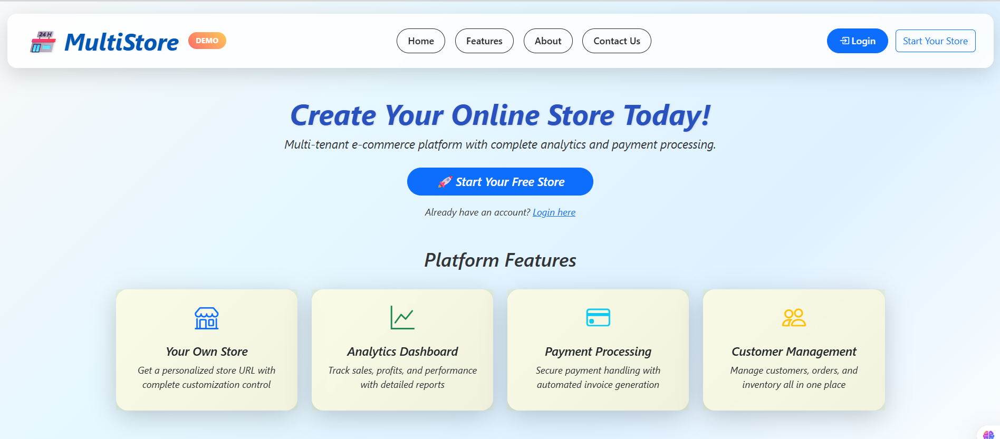
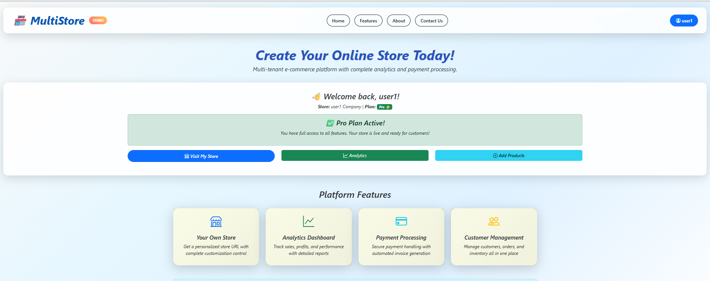
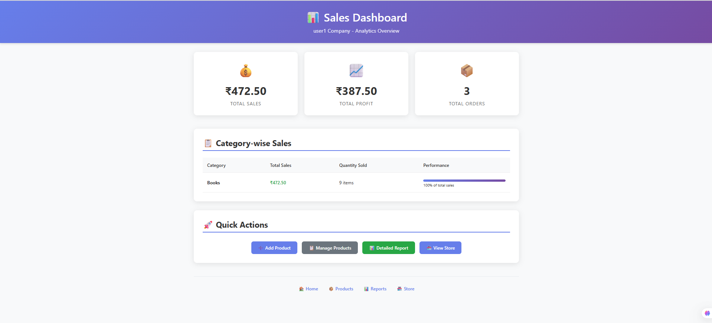
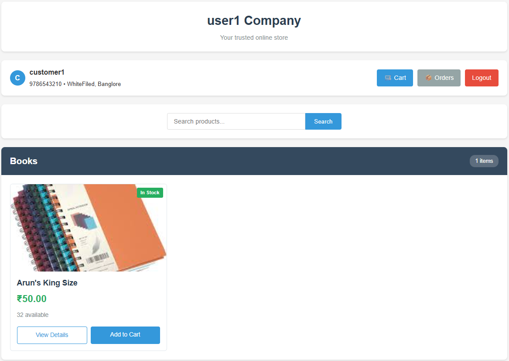
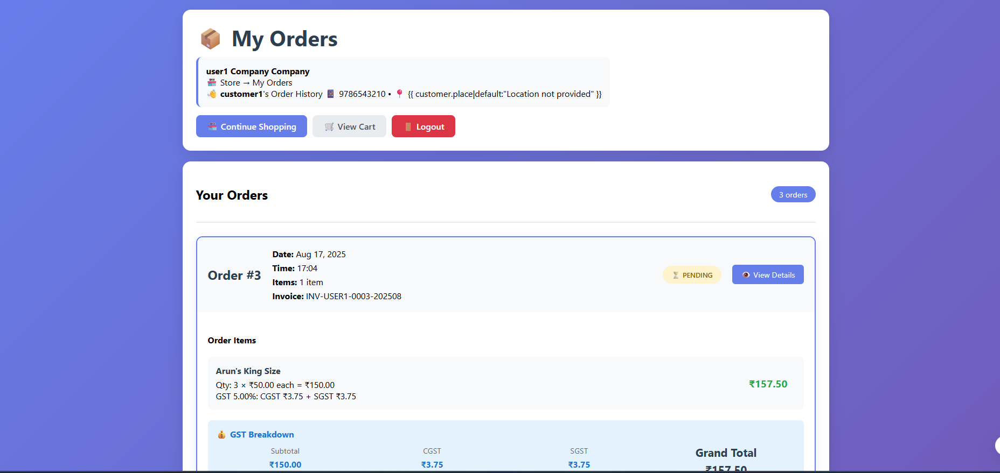
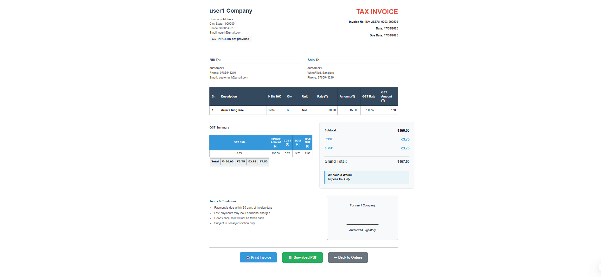

# 🧾 InvoxiaGST – Advanced E-Commerce & GST Billing Platform

A modern, full-stack **E-Commerce & GST Billing Platform** built to help small and medium businesses effectively manage their stores, products, customers, and financial analytics. 

It provides an isolated environment for each registered business owner, functioning as a multi-tenant application where every merchant can track their stock, generate compliant tax invoices, and analyze their performance.

This project was initially developed as part of a **Semester-2 project** and has evolved through multiple modernizations to include advanced analytics, real-time cart functionality, and strict tracking of financial data.

---

## 🚀 Key Features

### 🔐 Multi-Tenant Architecture & Subscriptions
- **Isolated Stores**: Each registered user maintains their own independent store, customers, products, and sales history.
- **Subscription Support**: Built-in support for free/pro subscription tiers, tracking payment status and expiry dates.
- **Store Customization**: Merchants can configure their company details (Global GSTIN, address, email) for customized invoice generation.

### 📦 Advanced Product & Inventory Management
- **Comprehensive Product Details**: Track purchase data (supplier name, invoice, date), HSN codes, and batch numbers.
- **Smart Pricing & Units**: Define measurement types (kg, grams, liter, ml) and unit values. Set wholesale purchase prices vs. retail selling prices.
- **Stock Tracking & Archiving**: Monitor initial stock against sold quantities. Hide outdated or discontinued products from the active catalog seamlessly using the **Inventory Archive System**.

### 🛍️ Dynamic Cart & Customer Management
- **Dedicated Shop Customers**: Customers are scoped to each store owner, ensuring data privacy and retention.
- **Real-Time Checkout**: A dynamic cart modal experience that evaluates items, calculates real-time subtotal, and exact tax application prior to checkout.

### 🧾 GST-Compliant Billing & Invoicing
- **Auto GST Calculation**: Tax engine perfectly categorizes inclusive/exclusive totals into CGST and SGST.
- **Invoice Generation**: Easily convert completed checkouts into professional PDF invoices.
- **Strict Transaction Dates**: Granular date tracking ensures that analytics and historical receipts reflect the correct point in time (rather than just creation time).

### 📊 Advanced Data (AD) & Analytics Dashboard
- **Robust Reporting**: View top-level summaries or dive deep into performance via the **Advanced Data (AD) Section**.
- **Accurate Financial Spread**: Track "Sold Value", "Total GST Collected", "Remaining Stock Value", and "Profits" sliced by month or year.
- **Exporting**: Export exact itemized billing or monthly sales reports into cleanly formatted **CSV** files for external accounting.

---

## 📁 Folder Structure
```bash
🏗️ Root Directory
E-Commerce/
├── manage.py
├── requirements.txt
├── README.md
├── .gitignore
│
├── E-Commerce/                    # Main project configuration (URLs, settings)
├── accounts/                      # Auth, CustomUser (Multi-tenant), Subscriptions
├── core/                          # Shared functionality
├── products/                      # General product utilities
├── store/                         # Main logic: Products, Carts, Orders, AD Analytics
│   ├── analytics.py               # Advanced Data (AD) endpoints and aggregation
│   ├── manage_products.py         
│   ├── models.py                  # Database schemas for Store operations
│   ├── urls.py
│   └── views.py                   # Business logic and rendering
│
├── templates/                     # Jinja2 / HTML templates
│   ├── ad_section.html            # Advanced Data table and dashboard
│   ├── cart.html                  # Dynamic cart and checkout
│   ├── invoice_template.html      # PDF export skeleton
│   ├── sales_dashboard.html
│   ├── user_analytics_dashboard.html
│   └── ... 
│
├── static/                        # CSS, JS, and global assets
├── media/                         # Uploaded product and company images
└── screenshots/                   # Docs imagery
```

---

## 🛠️ Technology Stack  

**Backend**  
- Python 3.11  
- Django  
- Jinja2 Templates  

**Database**
- PostgreSQL / SQLite (Default)

**Frontend**  
- HTML5, Vanilla CSS / Bootstrap, Vanilla JavaScript
- Dynamic DOM manipulation for the real-time cart and reporting filters  

---

## ⚡ Installation & Setup  

1. **Clone the Repository**  
```bash
git clone https://github.com/Tejas132005/E-Commerce-Platform.git
cd E-Commerce-Platform
```

2. **Create Virtual Environment & Install Dependencies**
```bash
python -m venv venv
source venv/bin/activate   # On Mac/Linux
venv\Scripts\activate      # On Windows

pip install -r requirements.txt
```

3. **Run Database Migrations**
```bash
python manage.py makemigrations
python manage.py migrate
```

4. **Start the Development Server**
```bash
python manage.py runserver
```

5. **Open in Browser:**
👉 http://127.0.0.1:8000

---

## 📸 Screenshots

### Home & Dashboard
  


### Sales & Analytics


### Customers & Orders



### Professional Invoicing


---

## 👥 Contributors
Tejas Jyoti – Developer

---

## 📜 License
This project is for educational purposes. You may use and modify it for learning.
