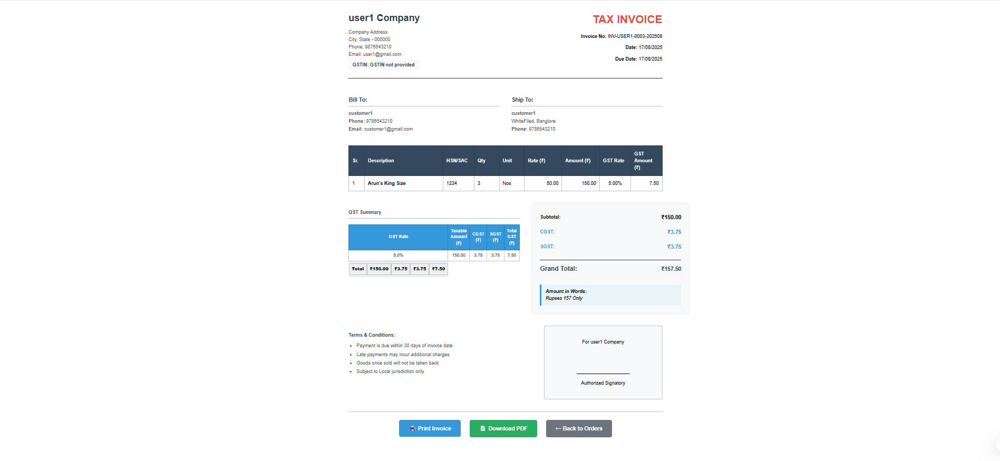

# 🧾 InvoxiaGST – GST Billing & Invoice Management System  

A full-stack **E-Commerce & GST Billing Platform** that helps small and medium businesses manage:  
✅ Customer & product records  
✅ GST-compliant invoice generation  
✅ Sales history & analytics dashboards  
✅ PDF invoice export  

This project was developed as part of a **Semester-2 project** to combine **Django concepts, frontend development, and analytics**.  

---
## 📁 Folder Structure

🏗️ Root Directory
E-Commerce/
├── manage.py                 # Django management script
├── requirements.txt          # Python dependencies
├── README.md                # Project documentation

🔧 Django Configuration
E-Commerce/
├── E-Commerce/              # Main Django project settings
│   ├── settings.py          # Django settings configuration
│   ├── urls.py             # Main URL routing
│   ├── asgi.py             # ASGI configuration
│   └── wsgi.py             # WSGI configuration

👥 User Management (accounts app)
E-Commerce/
├── accounts/                # User authentication & profiles
│   ├── models.py            # Custom user models
│   ├── forms.py             # User registration/login forms
│   ├── views.py             # Authentication views
│   ├── urls.py              # User-related URLs


🏪 Core Store Functionality (store app)
E-Commerce/
├── store/                   # Main e-commerce functionality
│   ├── __init__.py
│   ├── models.py            # Product, Order, Customer models
│   ├── views.py             # Store views & logic
│   ├── forms.py             # Product/Order forms
│   ├── urls.py              # Store URL routing
│   ├── analytics.py         # Sales analytics functions
│   ├── manage_products.py   # Product management utilities
│   ├── middleware.py        # Custom middleware


🎯 Core App (core app)
E-Commerce/
├── core/                    # Core functionality & utilities
│   ├── __init__.py
│   ├── models.py            # Core models
│   ├── views.py             # Core views
│   ├── forms.py             # Core forms
│   ├── urls.py              # Core URL routing
│   ├── admin.py             # Admin interface configuration
│   ├── apps.py              # App configuration

🎨 Frontend Templates
E-Commerce/
├── templates/               # HTML templates
│   ├── base.html            # Base template layout
│   ├── home.html            # Homepage
│   ├── dashboard.html       # Main dashboard
│   ├── login.html           # Login page
│   ├── register.html        # Registration page
│   ├── customer_login.html  # Customer login
│   ├── customer_register.html # Customer registration
│   ├── products_page.html   # Product listing
│   ├── product_detail.html  # Individual product view
│   ├── cart.html            # Shopping cart
│   ├── order.html           # Order processing
│   ├── order_detail.html    # Order details
│   ├── my_orders.html       # Customer order history
│   ├── invoice_template.html # Invoice generation
│   ├── payment_success.html # Payment confirmation
│   ├── analytics_dashboard.html # Analytics view
│   ├── sales_dashboard.html # Sales overview
│   ├── sales_report.html    # Sales reports
│   ├── stock_details.html   # Inventory management
│   ├── add_product.html     # Add new product
│   ├── update_product.html  # Edit product
│   ├── delete_product.html  # Remove product
│   ├── user_analytics_dashboard.html # User analytics
│   ├── subscription_history.html # Subscription tracking
│   ├── history.html         # Transaction history
│   ├── about.html           # About page
│   ├── contact.html         # Contact information
│   ├── docs.html            # Documentation
│   ├── plan.html            # Subscription plans
│   └── error.html           # Error pages

📁 Static Files & Media
E-Commerce/
├── static/                  # CSS, JS, images (static assets)
├── media/                   # User-uploaded files
│   └── products/            # Product images
│       ├── aruns_notebook_D2rwnrJ.jpeg
│       ├── aruns_notebook.jpeg
│       ├── classmate_spiral_notebook.jpeg
│       └── oreo_buscuit.jpeg

📸 Documentation & Screenshots
E-Commerce/
├── screenshots/             # Application screenshots
│   ├── home_page.png        # Homepage screenshot
│   ├── dashboard.png        # Dashboard view
│   ├── sales.png            # Sales dashboard
│   ├── customer_dashboard.png # Customer view
│   ├── myorders.png         # Order management
│   └── Invoice.png          # Invoice example

---

## 🚀 Features  

### 🔐 Authentication & User Management  
- Secure login and signup  
- Each registered user maintains their own store  
- Separate database per registered user  

### 📦 Customer & Product Management  
- Add, update, or delete products  
- Product fields:  
  - Name  
  - GST Rate  
  - Selling Price  
  - Stock availability  

### 🧾 Invoice Management  
- Auto GST calculation (SGST + CGST)  
- Create invoices with multiple products  
- Download invoices as **PDF**  

### 📜 Invoice History & Filters  
- Track sales by **customer** or **date**  
- View history of sold items and stock left  
- Track payment status  

### 📊 Data Analytics Dashboard  
- Monthly & yearly GST collection reports  
- Product-wise sales summaries  
- Top customer insights  

### 📤 Export  
- Export invoices as PDF  

---

## 🛠️ Technology Stack  

**Backend**  
- Python 3.11  
- Django 
- Jinja2 templates  

**Database**
- PostgreSQL

**Frontend**  
- HTML, CSS, Bootstrap , JavaScript 
 

---

## ⚡ Installation & Setup  

1. **Clone the Repository**  
```bash
git clone https://github.com/Tejas132005/E-Commerce-Platform.git
cd E-Commerce-Platform

2. Create Virtual Environment & Install Dependencies
```bash
python -m venv venv
source venv/bin/activate   # On Mac/Linux
venv\Scripts\activate      # On Windows

pip install -r requirements.txt

3. Run Database Migrations
```bash
python manage.py migrate

4. Start the Server
```bash
python manage.py runserver

5. Open in browser:
👉 http://127.0.0.1:8000

---

📸 Screenshots

## home page/ dashboard
  


## Sales


## Customers 


## Invoice 


---

👥 Contributors
Tejas Jyoti – Developer

---

📜 License
This project is for educational purposes. You may use and modify it for learning.
